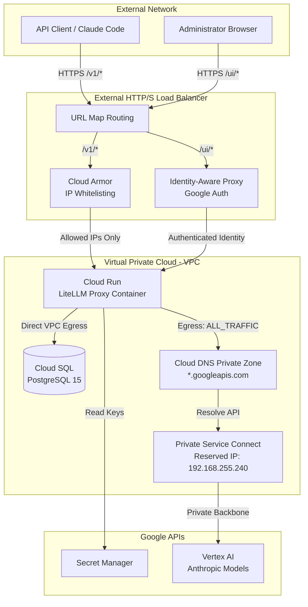

# Vertex AI LiteLLM Proxy

A secure, private, and managed proxy architecture for Anthropic models on Google Cloud Vertex AI using LiteLLM. This repository provides a fully automated Infrastructure as Code (IaC) deployment using Terraform.

## Architecture Overview

This project establishes a dual-path security model to safely expose LiteLLM to developers while protecting its administrative dashboard. It also ensures that all outbound traffic from the proxy to Vertex AI remains within the Google Cloud private network backbone.

### Architecture Diagram



## Architecture Components

*   **External HTTP(S) Load Balancer**: Acts as the single entry point. It terminates SSL connections and routes traffic based on URL paths.
*   **Cloud Armor**: Applied to the `/v1/*` path. It restricts API access to explicitly whitelisted IP addresses, providing a strong perimeter defense against unauthorized programmatic access.
*   **Identity-Aware Proxy (IAP)**: Applied to the `/ui/*` path. It requires Google Account authentication before allowing access to the LiteLLM administrative dashboard.
*   **Cloud Run (LiteLLM)**: The core proxy application. It is configured with `INGRESS_TRAFFIC_INTERNAL_LOAD_BALANCER` to prevent direct internet access and `egress = "ALL_TRAFFIC"` to force all outbound requests through the VPC.
*   **Cloud SQL (PostgreSQL)**: Serves as the persistent data store for LiteLLM, managing virtual keys, user configurations, and telemetry data. It operates purely on private IP, accessible via Direct VPC Egress from Cloud Run.
*   **Secret Manager**: Securely stores sensitive information such as the LiteLLM Master Key and Database connection string.
*   **Private Service Connect (PSC) & Cloud DNS**: Re-routes requests destined for `*.googleapis.com` to a reserved internal IP address (`192.168.255.240`). This ensures that Vertex AI API calls from LiteLLM do not traverse the public internet, satisfying data sovereignty and exfiltration requirements.

## Note on VPC Service Controls (VPC-SC)

While VPC-SC is a common mechanism to prevent public endpoint bypass, it is intentionally excluded from this configuration. Enabling VPC-SC on the Vertex AI API (`aiplatform.googleapis.com`) blocks the Web-Search grounding capabilities of Anthropic models. The current PSC configuration provides network isolation without sacrificing model functionality.

## Deployment Guide

### Prerequisites

1. Google Cloud SDK (`gcloud`) installed and authenticated.
2. Terraform (`>= 1.5.0`) installed.
3. A registered domain name pointing to the static IP created by Terraform.
4. An existing Docker image of LiteLLM in Artifact Registry (e.g., `us-central1-docker.pkg.dev/YOUR_PROJECT/litellm-repo/litellm-proxy:latest`).

### Deployment Steps

1. Configure the `variables.tf` file or provide a `terraform.tfvars` file with your specific environment details:
   ```hcl
   project_id      = "your-gcp-project-id"
   region          = "us-central1"
   domain_name     = "your.domain.com"
   allowed_ip      = "203.0.113.1/32"
   iap_admin_email = "admin@yourcompany.com"
   ```

2. Initialize and apply the Terraform configuration:
   ```bash
   cd terraform_litellm
   terraform init
   terraform apply
   ```

3. Update your DNS provider's A record with the newly generated Global IP address outputted by Terraform.

4. Wait 10-20 minutes for the Google Managed SSL Certificate to provision and the Load Balancer rules to propagate globally.

## Usage

### Dashboard Access (/ui)
Navigate to `https://your.domain.com/ui` in a web browser. You will be prompted to authenticate via Google IAP. Once authenticated, enter the `LITELLM_MASTER_KEY` to access the admin panel.

### API Access (/v1/*)
Configure your client (e.g., Claude Code or curl) to use the endpoint. The request must originate from an IP address listed in the Cloud Armor policy.

```json
{
  "endpoint": "https://your.domain.com/v1",
  "api_key": "sk-your-virtual-key",
  "model": "claude-sonnet-4-6"
}
```

## Troubleshooting

For known issues and solutions (e.g., `output_config: Extra inputs are not permitted`), see [TROUBLESHOOTING.md](TROUBLESHOOTING.md).
